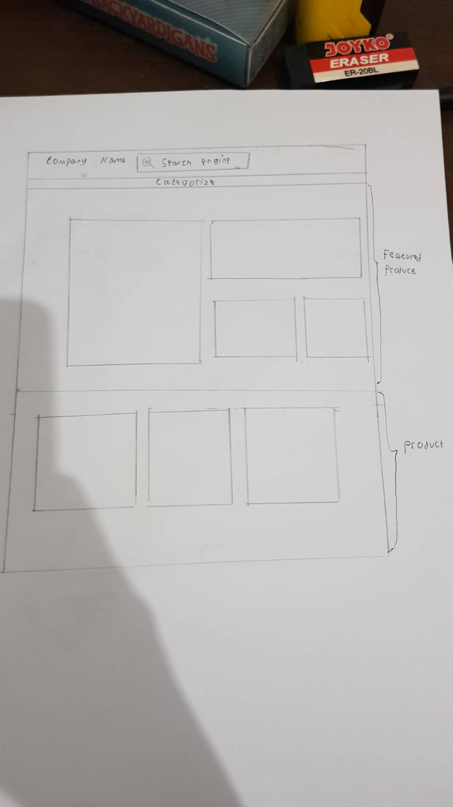

# Sketching and Prototyping
Using the information in the results of Assignment 1 for what is good and bad about the UI for designed tasks, we are going to make **Sketches** and **Prototypes**. These sketches and prototypes will lead to better design in Assignment 3. The prototypes will be then tested through a usability evaluation followed by design revision in Assignment 4.

## Part A: Sketches
Sketch at least **3 (three)** different UIs for the functions you are targeting. These three interfaces should be _dramatically different_ in terms of design directions. For example, they can be with different organizations of what functions on each screen or using a different layout of the icons, widgets, and menus on the screens. If you want, you can also incorporate non-on-screen UIs: physical buttons, gestures through motion sensors, etc.

You need **not** sketch the whole interface. It is not necessary for the sketches to have every function or every function in detail, but there should be enough to show off your general idea. **Be creative!** Draw your idea and label a few of the widgets so we can tell your intent. The goal is to have at least 3 good UIs in *interesting* ways. Sketches should be done on paper with pens and/or pencils (do not use a computer).

### 1. Scan/Photo of Sketches
#### 1.1 Original

#### 1.2 Solution 1

#### 1.3 Solution 2

#### 1.4 Solution 3

### 2. Version Differences

##### 2.1 Original
user see too much product on a singgle page , the product hasn't good arranged

##### 2.2 Solution 1
there is a navbar that hold search function and category . under the navbar there are some promotion page

##### 2.3 Solution 2
there is a navbar that hold search function. on the left of the screen there are some sidebar that hold categorize and on the mid there are some featured product

##### 2.4 Solution 3
there is a navbar that hold category . under the navbar there are some search bar that fully covered the page

### 3. Selected Sketch
i like the frits one because its more simple and there is easy to apply 
### 4. Design Rationale
Based on contextual inquiry . frist one is good because there is only one navbar with 2 function so the user can easily know how to search or how to select the category without another distraction
## Part B: Assumptions
### 1. Hardware
- Operating System (like mac windows or linux)
- Physical Input : Mouse and Keyboard
- Screen Color : RGB
- Browser

### 2. Users
1. All User that ever operating computer before
2. the experience level only depend how fast the user can understand the page
3. 10-60 ages

## Part C: Prototypes
We will work on this part together during the class on **March 22nd, 2019**, 10:00 AM - 12.30 PM. Therefore, prior to the class please complete all the above parts (A & B) beforehand accordingly.
